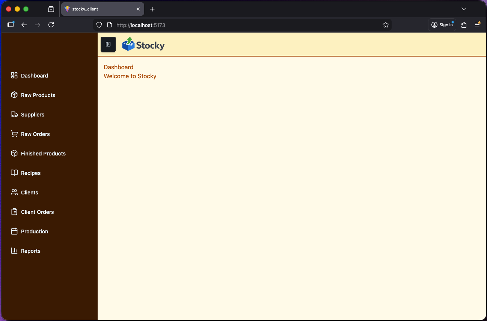

# Stocky

> Stocky — Track. Manage. Grow.

An inventory management web application that helps users track, organize, and control their stock in real time

🥲 I think ([@Lil-Code30](https://github.com/Lil-Code30)) is lazy to complete this project and he do not want to vibecode the rest.
IF YOU see this project interesting, we are open on contribution and pull request

- Complete [REST API here](https://github.com/DripCode-Studio/stocky_backend)
- Complete [API Endpoints Guides](https://github.com/DripCode-Studio/stocky_backend/blob/main/API_TESTING.md)

## Intitial Frontend View

